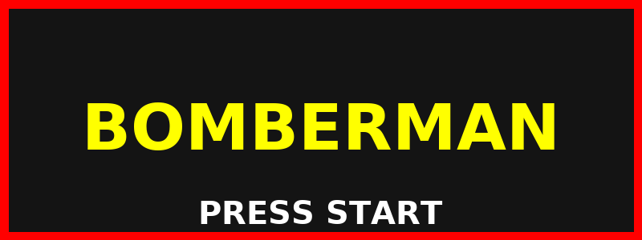
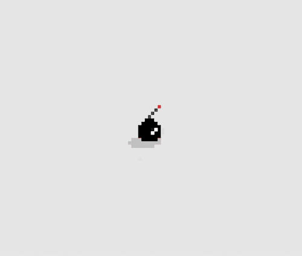
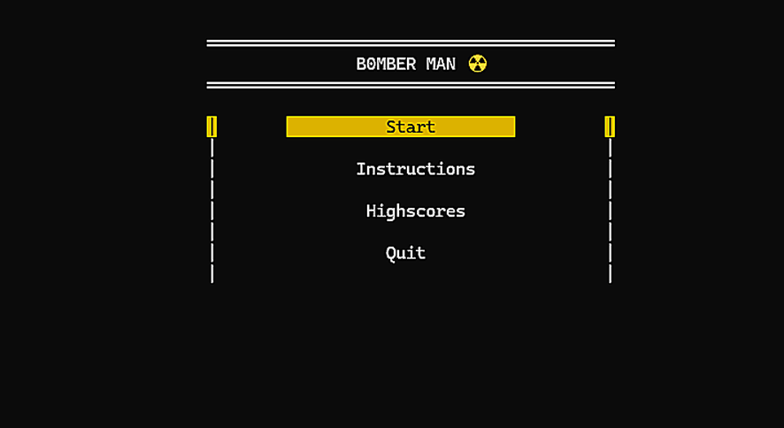

<!-- Bomberman Arcade Marquee Header -->

  

---

## 🎮 Overview

Bomberman is a **single-player C++ console game** where you navigate a grid, drop bombs, destroy blocks, and outsmart enemies to advance through **3 challenging stages**.

---

## ✨ Features

🕹️ **Movement:** `W` `A` `S` `D`  
💣 **Bomb Placement:** `Spacebar`  
🚀 **Stages:** Progressive difficulty  
⚡ **Power-Ups:**
- 💨 Speed Boost – `$`
- 💥 Bomb Range Boost – `+`
- 🛡️ Immunity – `I`

👾 **Enemies:**
- 🟡 Normal – `E`
- 🔴 Special – `S`

🧱 **Dynamic Elements:** Moving indestructible blocks  
🏆 **Scoring:** Earn points for kills, destruction, and stage completion.

---

<!-- Typing Animation -->

  

---

<!-- Pixel Bomb Explosion -->

  

---

## 📸 Gameplay Preview

  

---

## 🕹️ How to Play

1. Launch from terminal.
2. Move: **W/A/S/D**  
3. Bomb: **Spacebar**  
4. Quit: **Q**  
5. Destroy enemies & blocks, avoid explosions.
6. Clear all enemies to progress.

---

## 🛠️ Technical Details

**Language:** C++  
**Libraries:** `<iostream>` `<windows.h>` `<conio.h>` `<time.h>` `<chrono>` `<fstream>` `<iomanip>` `<string>` `<locale>` `<sstream>`  

**Mechanics:**  
- **2D Board:** `char board[m][n]`  
- **Timers:** `GetTickCount64()`  
- **Randomization:** `rand()`  
- **Stages:** Unique layouts

---

